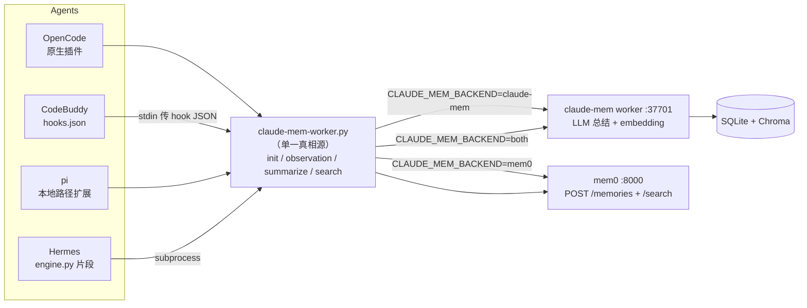

# agent-memory-bridge

**一座桥，把你用过的每个 AI 编程 Agent 的对话都捕获进同一个可检索的记忆库。**

[English](./README.md) · [简体中文](./README.zh-CN.md)

[](./LICENSE)
[](#)
[](#贡献)

## 为什么做这个

同时用 OpenCode、CodeBuddy、pi、Hermes 多个 Agent 时，每个都要各搞一套记忆捕获：不同的 hook、不同的 HTTP 报文、不同的坑。维护四份 curl 片段，协议必然慢慢分叉，某个 hook 悄悄坏了就再也记不住东西。

**agent-memory-bridge** 把这些全部收敛成**单一真相源**：

- 一个统一脚本（`claude-mem-worker.py`）严格对齐 worker 协议；
- 每个 Agent 只保留一个极小的适配器，负责捕获事件后交给统一脚本；
- 捕获失败**绝不阻塞 Agent**——hook 秒级返回，异常静默降级。

记忆后端是 [claude-mem](https://github.com/thedotmack/claude-mem)（本机 worker，负责总结、embedding、语义检索）。同时内置 [mem0](https://github.com/mem0ai/mem0) 后端，也可以双写。

## 特性

- **一个仓，Agent 自选**——`./install.sh --agent <name>` 按需安装 OpenCode / CodeBuddy / pi / Hermes 的适配。
- **一套协议，四个适配**——会话 ID 统一加前缀（`<agent>-<sessionId>`），不同 Agent 不会撞会话；报文字段完全一致。
- **后端可插拔**——`claude-mem`（会话制 + LLM 总结）、`mem0`（扁平存储，服务端抽事实）、`both`（双写），一个环境变量切换。
- **为 hook 而生**——短超时、退避重试、worker 不可达时静默 `exit 0`，编辑器永远不会因为记忆调用卡住。
- **JSON 安全**——用 `jq` / `python3` 构造报文，引号、反斜杠、多行工具输出都不会损坏 payload。
- **有测试**——OpenCode 插件自带 8 项 mock 测试（捕获、去重、重试、检索）；`test-hooks.sh` 用本地 mock worker 跑通全部 shell hook。

## 架构



四个 Agent 共享**同一个记忆库**：你在 OpenCode 里说过的事，CodeBuddy 也能回忆起来。

## 快速开始

### 前置条件

- `bash`、`curl`、[`jq`](https://jqlang.github.io/jq/)、`python3`
- 一个在运行的记忆后端：
  - **claude-mem**（默认）：安装并启动 worker，确认
    `curl -s http://127.0.0.1:37701/api/health` 返回 `"status":"ok"`；
  - **mem0**（可选）：8000 端口上的 mem0 服务。

```bash
git clone https://github.com/<your-org>/agent-memory-bridge.git
cd agent-memory-bridge
```

### 安装

```bash
./install.sh --all                 # 安装全部 Agent
./install.sh --agent codebuddy     # 只装一个
./install.sh --dry-run             # 只预览动作，不写文件
```

安装器会把 `claude-mem-worker.py` 复制到 `~/.local/share/claude-mem/`，生成 `.env` / `.env.example` 模板，并把所选适配落到各 Agent 的真实配置位置。可用 `--prefix` 或 `CLAUDE_MEM_INSTALL_ROOT` 改安装根。

### 验证

```bash
python3 ~/.local/share/claude-mem/claude-mem-worker.py health   # 后端可达
./test-hooks.sh                                              # 用 mock worker 跑通所有 hook
```

随后按你的 Agent 完成**一次性启用**（注册插件、把 hooks 合并进 settings.json 等），详见 [docs/zh/INSTALL.md](./docs/zh/INSTALL.md)。

## 支持的 Agent

| Agent | 适配目录 | 接入方式 | 是否经统一脚本 |
|---|---|---|---|
| **OpenCode** | [`agents/opencode`](./agents/opencode) | 原生插件带单测；默认 spawn 统一 `.py` shim | **是**（默认；`CLAUDE_MEM_TRANSPORT=http` 可绕过） |
| **pi** | [`agents/pi`](./agents/pi) | 原生 TS 扩展，以**本地路径包**加载；默认 spawn 统一 `.py` shim | **是**（默认；`CLAUDE_MEM_TRANSPORT=http` 可绕过） |
| **CodeBuddy** | [`agents/codebuddy`](./agents/codebuddy) | `hooks.json` 命令 hook，stdin 传 JSON | **是** |
| **Hermes** | [`agents/hermes`](./agents/hermes) | `engine.py` 里 subprocess 调用 | **是** |

有原生 HTTP 客户端的 Agent 直连 worker；只能执行外部命令的 Agent 走 shell 封装。两边产出的协议完全相同。

## 选择记忆后端

设置 `CLAUDE_MEM_BACKEND`（默认 `claude-mem`）：

| 后端 | 行为 |
|---|---|
| `claude-mem` | 会话制：`init` → `observation` → `summarize`，worker 端跑 LLM 总结 |
| `mem0` | 扁平：一条 `observation` = 一次 `POST /memories`（服务端 infer 抽事实）；`init`/`summarize` 为 no-op |
| `both` | 两个库双写 |

```bash
CLAUDE_MEM_BACKEND=mem0 python3 claude-mem-worker.py observation codebuddy s1 "..." /tmp user_prompt codebuddy
CLAUDE_MEM_BACKEND=both python3 claude-mem-worker.py search "关键词" 5
```

`mem0-worker.py` 是薄封装，等价于固定 `CLAUDE_MEM_BACKEND=mem0`。mem0 相关变量：`MEM0_HOST`（localhost）、`MEM0_PORT`（8000）、`MEM0_API_KEY`（可空）、`MEM0_USER_ID`（$USER）、`MEM0_INFER`（true），也可直接给完整的 `MEM0_BASE_URL`。

> **mem0 租户坑**：API Key 绑定特定用户视图。写入和检索必须用同一个视图，否则写进去也搜不出来。

## 统一脚本速查

```bash
python3 claude-mem-worker.py init        <agent> <sessionId> [cwd] [project] [prompt]
python3 claude-mem-worker.py observation <agent> <sessionId> <text> [cwd] [toolName] [platformSource]
python3 claude-mem-worker.py summarize   <agent> <sessionId> [lastAssistantMessage] [platformSource]
python3 claude-mem-worker.py turn        <agent> <sessionId> <transcriptPath> [cwd] [platformSource]
python3 claude-mem-worker.py search      <query> [limit]
python3 claude-mem-worker.py health
python3 claude-mem-worker.py hook        <agent>   # 从 stdin 读 Claude Code/CodeBuddy hook JSON
```

`hook` 会自动映射 stdin 事件：

| stdin `hook_event_name` | 转发为 |
|---|---|
| `SessionStart` | 忽略（真正的会话在首次提问时建，避免空会话） |
| `UserPromptSubmit` | `init` 并存 prompt |
| `PostToolUse` | `observation`（`tool_name=工具名`） |
| `Stop` | `summarize` |

环境变量覆盖：`CLAUDE_MEM_WORKER_HOST`（127.0.0.1）、`CLAUDE_MEM_WORKER_PORT`（37701）、`CLAUDE_MEM_HTTP_TIMEOUT`（8 秒）、`CLAUDE_MEM_HTTP_RETRIES`（2）、`CLAUDE_MEM_QUIET`（0）。

## 文档

- [docs/zh/INSTALL.md](./docs/zh/INSTALL.md) —— 详细分步安装与各 Agent 启用位置
- [docs/zh/CONFIG-REFERENCE.md](./docs/zh/CONFIG-REFERENCE.md) —— 可直接复制的四 Agent 配置快照与避坑清单
- [docs/zh/AGENT-RUNTIME-ARCH.md](./docs/zh/AGENT-RUNTIME-ARCH.md) —— worker 两条链路（REST 落库 vs. 依赖 claude CLI 的智能压缩）
- [docs/zh/REGRESSION-TEST-STANDARD.md](./docs/zh/REGRESSION-TEST-STANDARD.md) —— 回测验收基线：hook 事件、记忆召回、总结
- [agents/pi/DEPLOY.md](./agents/pi/DEPLOY.md) —— pi 本地路径记忆扩展部署文档

> 四篇指南的英文翻译在 [`docs/`](./docs) 根目录。

## Roadmap

- 更多 Agent 适配（Claude Code CLI、Gemini CLI、Cursor 等）
- 带校验和的发布包
- 基于临时 worker 容器的端到端测试

## 贡献

欢迎 Issue 和 PR。新增一个 Agent 适配只需两件事：捕获它的生命周期事件（会话开始、用户提问、工具调用、助手回复、会话结束），并映射到统一脚本或等价的 JSON 报文。请同时补一个 mock 测试或 `test-hooks.sh` 用例。

## 开源协议

[MIT](./LICENSE)
